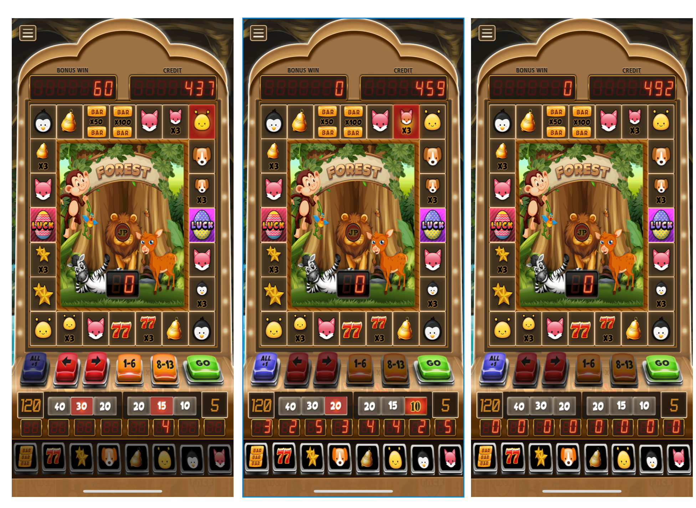

# SlotFruit-Unity3D
开源最最最最精品的老虎机iOS代码，独家设计。 可自定义积分，无需支付，可直接换皮上架iOS

-----

SlotFruit
SlotFruit is a simple slot game.

The technique is basic but can be used for some fun effects. The extension is written in Swift, and an earlier version of the shatter() function was used in Rogue Assassin.

video

https://youtube.com/shorts/oiWRm5_Vmsg

Author
@zeus

License
Source code and related resources are Copyright (C) Matthew Reagan 2016. The source code is released under the MIT License.
